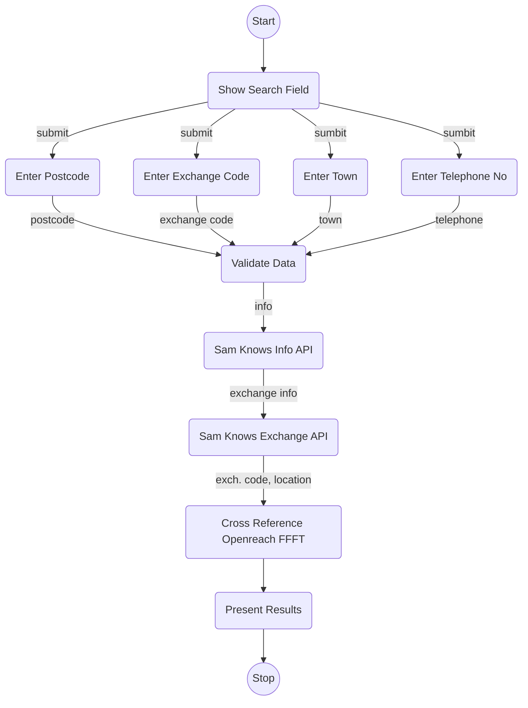

```mermaid    
    flowchart TB
        A(Show Search Field)
        B(Enter Postcode)
        C(Enter Exchange Code)
        D(Enter Town)
        E(Enter Telephone No)
        F(Validate Data)
        G(Sam Knows Info API)
        H(Sam Knows Exchange API)        
        I(Cross Reference Openreach FFFT)
        J(Present Results)
        X((Start))
        Y((Stop))
        
        X --> A        
        A --> |submit|B
        A --> |submit|C
        A --> |sumbit|D
        A --> |sumbit|E

        B --> |postcode|F
        C --> |exchange code|F
        D --> |town|F
        E --> |telephone|F

        F --> |info|G        
        G --> |exchange info|H
        H --> |exch. code, location|I
        
        I --> J
        J --> Y
        

        


        

        
        
```     

        
